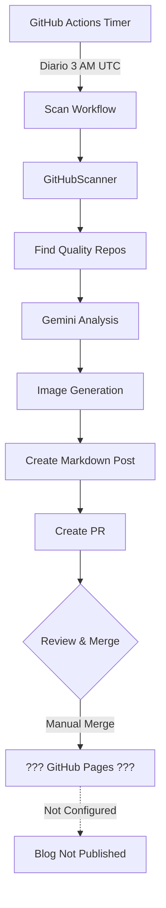
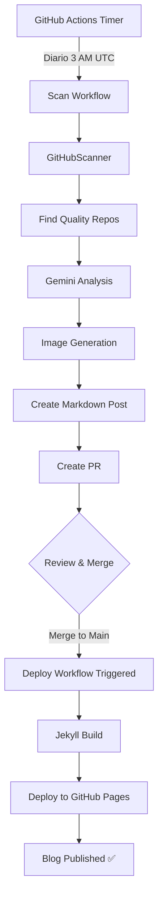

# 🔍 Análisis del Sistema de Blog y GitHub Pages

**Fecha:** 25 de noviembre de 2025  
**Estado:** Sistema funcional con mejoras recomendadas

---

## 📊 Resumen Ejecutivo

### ✅ Estado Actual

| Componente | Estado | Funcionalidad |
|------------|--------|---------------|
| **Workflow de Escaneo** | ✅ Funcional | Genera blogs automáticamente |
| **GitHub Pages** | ⚠️ Parcialmente configurado | Falta configuración completa |
| **Generación de Posts** | ✅ Funcional | Crea posts con análisis AI |
| **Generación de Imágenes** | ✅ Funcional | Diagramas con Nano Banana 2 |
| **PR Automáticos** | ✅ Funcional | Crea PRs para revisión |

---

## 🔧 Análisis del Workflow

### 1. Workflow Principal: `scan-and-blog.yml`

**Ubicación:** `.github/workflows/scan-and-blog.yml`

**Configuración Actual:**
```yaml
name: Scan Repos & Generate Blog

on:
  schedule:
    - cron: '0 3 * * *'  # Diario a las 3:00 UTC (10 PM EST)
  workflow_dispatch:      # Ejecución manual

jobs:
  scan-and-blog:
    runs-on: ubuntu-latest
```

**Proceso:**
1. ✅ Checkout del repositorio con historial completo
2. ✅ Setup Python 3.11
3. ✅ Instalación de dependencias (incluye Playwright)
4. ✅ Configuración de Git para commits
5. ✅ Escaneo de repositorios en GitHub
6. ✅ Generación de análisis con Gemini
7. ✅ Generación de imágenes (diagramas)
8. ✅ Creación de post en Markdown
9. ✅ Creación de Pull Request automático

**Variables de Entorno Requeridas:**
- ✅ `GITHUB_TOKEN` - Token de acceso (automático)
- ✅ `GOOGLE_API_KEY` - API key de Gemini (configurado)

---

### 2. Script de Generación: `workflow_generate_blog.py`

**Ubicación:** `scripts/workflow_generate_blog.py`

**Funcionalidad:**

```python
# Flujo implementado
1. Scan GitHub repos      → GitHubScanner
2. Validate repo quality  → scanner.validate_repo()
3. Generate AI analysis   → ScriptWriter (Gemini)
4. Generate images        → ImageGenerator (Nano Banana 2)
5. Create blog post       → MarkdownWriter
6. Validate post          → markdown_writer.validate_post()
```

**Características:**
- ✅ Busca repositorios de calidad con límite configurable
- ✅ Valida repos antes de procesar
- ✅ Genera 2 tipos de imágenes:
  - Architecture diagram
  - Problem-solution flow
- ✅ Maneja errores de generación de imágenes (continúa sin ellas)
- ✅ Valida el post antes de completar

**Outputs:**
- Posts en: `blog/_posts/YYYY-MM-DD-repo-name.md`
- Imágenes en: `blog/assets/images/repo-name/`

---

## 🌐 Estado de GitHub Pages

### Configuración Actual

**Archivo:** `blog/_config.yml`

```yaml
title: "Open Source Gems"
description: "Discover amazing open source projects with AI-powered analysis"
baseurl: "/op-to-video"
url: "https://yourusername.github.io"  # ⚠️ Necesita actualización

# Build settings
markdown: kramdown
theme: minima
plugins:
  - jekyll-feed
  - jekyll-seo-tag
```

### ⚠️ Problemas Identificados

1. **URL Placeholder:**
   ```yaml
   url: "https://yourusername.github.io"  # ❌ No actualizado
   ```
   **Debe ser:**
   ```yaml
   url: "https://iberi22.github.io"
   ```

2. **Falta Workflow de Deploy:**
   - No existe `.github/workflows/pages.yml`
   - GitHub Pages no está configurado para auto-deploy

3. **Baseurl Correcto:**
   ```yaml
   baseurl: "/op-to-video"  # ✅ Correcto para repo no raíz
   ```

---

## 📁 Contenido del Blog

### Posts Existentes

```
blog/_posts/
├── 2025-11-23-example-post.md              # Post de ejemplo
└── 2025-11-23-test-automation-tool.md      # Post generado
```

### Estructura de Posts

Los posts generados incluyen:
- ✅ Frontmatter con metadata (título, fecha, categorías)
- ✅ Análisis del proyecto
- ✅ Características principales
- ✅ Casos de uso
- ✅ Imágenes embebidas (si se generaron)
- ✅ Enlaces al repositorio

---

## 🔍 Problemas y Recomendaciones

### 🚨 Problemas Críticos

#### 1. GitHub Pages No Configurado Completamente

**Problema:**
- No hay workflow para publicar a GitHub Pages
- URL en `_config.yml` es placeholder
- No está claro si GitHub Pages está habilitado en settings

**Solución:**
```yaml
# Crear .github/workflows/deploy-blog.yml
name: Deploy Blog to GitHub Pages

on:
  push:
    branches: [main]
    paths:
      - 'blog/**'
  workflow_dispatch:

permissions:
  contents: read
  pages: write
  id-token: write

jobs:
  build:
    runs-on: ubuntu-latest
    steps:
      - uses: actions/checkout@v4
      
      - name: Setup Ruby
        uses: ruby/setup-ruby@v1
        with:
          ruby-version: '3.1'
          bundler-cache: true
          working-directory: ./blog
      
      - name: Build with Jekyll
        run: |
          cd blog
          bundle exec jekyll build
        env:
          JEKYLL_ENV: production
      
      - name: Upload artifact
        uses: actions/upload-pages-artifact@v2
        with:
          path: ./blog/_site

  deploy:
    environment:
      name: github-pages
      url: ${{ steps.deployment.outputs.page_url }}
    runs-on: ubuntu-latest
    needs: build
    steps:
      - name: Deploy to GitHub Pages
        id: deployment
        uses: actions/deploy-pages@v3
```

#### 2. Configuración de _config.yml

**Actualizar:**
```yaml
url: "https://iberi22.github.io"
baseurl: "/plantilla-ingenieria-contexto"  # O nombre del repo
```

#### 3. Gemfile Faltante

**Problema:** No hay `blog/Gemfile` para Jekyll

**Solución:**
```ruby
# blog/Gemfile
source "https://rubygems.org"

gem "jekyll", "~> 4.3"
gem "minima", "~> 2.5"

group :jekyll_plugins do
  gem "jekyll-feed", "~> 0.12"
  gem "jekyll-seo-tag", "~> 2.8"
end
```

---

### ⚠️ Problemas Menores

#### 1. Workflow Duplicado

**Problema:**
- Existen `scan-and-blog.yml` y `scan_and_blog.yml` (con guión bajo)
- Puede causar confusión

**Solución:** Eliminar uno de ellos (preferiblemente el con guión bajo)

#### 2. Hourly Scan Workflow

**Archivo:** `.github/workflows/hourly_scan.yml`

**Observación:**
- Ejecuta pipeline completo cada hora
- Puede ser muy frecuente y consumir cuota de Actions
- Genera videos, no solo posts

**Recomendación:**
```yaml
schedule:
  - cron: '0 */6 * * *'  # Cada 6 horas en lugar de cada hora
```

#### 3. Manejo de Errores en Generación

**Problema:** Si no encuentra repos válidos, el workflow termina silenciosamente

**Solución:** Agregar notificación o issue automático

---

## 🎯 Plan de Acción Recomendado

### Fase 1: Habilitar GitHub Pages (30 min)

1. **Actualizar `_config.yml`:**
   ```bash
   url: "https://iberi22.github.io"
   baseurl: "/plantilla-ingenieria-contexto"
   ```

2. **Crear `blog/Gemfile`** (ver arriba)

3. **Crear workflow de deploy** (`.github/workflows/deploy-blog.yml`)

4. **Habilitar GitHub Pages en settings:**
   - Ir a Settings → Pages
   - Source: GitHub Actions
   - Branch: main
   - Folder: /blog

5. **Ejecutar workflow manualmente** para primer deploy

---

### Fase 2: Mejorar Workflows (15 min)

1. **Consolidar workflows duplicados:**
   ```bash
   git rm .github/workflows/scan_and_blog.yml
   ```

2. **Ajustar frecuencia de hourly_scan:**
   ```yaml
   cron: '0 */6 * * *'  # Cada 6 horas
   ```

3. **Agregar trigger por path:**
   ```yaml
   on:
     push:
       paths:
         - 'blog/**'
   ```

---

### Fase 3: Testing y Validación (15 min)

1. **Ejecutar workflow manual:**
   ```bash
   gh workflow run scan-and-blog.yml
   ```

2. **Verificar PR generado**

3. **Merge PR y verificar deploy**

4. **Validar sitio:** `https://iberi22.github.io/plantilla-ingenieria-contexto/blog/`

---

## 📊 Análisis de Integración

### Flujo Completo Actual



### Flujo Deseado



---

## ✅ Conclusiones

### Lo que Funciona Bien

1. ✅ **Escaneo automatizado** - Workflow diario funcionando
2. ✅ **Análisis AI** - Gemini genera contenido de calidad
3. ✅ **Generación de imágenes** - Diagramas visuales útiles
4. ✅ **PRs automáticos** - Buen flujo de revisión
5. ✅ **Estructura del blog** - Jekyll bien configurado

### Lo que Falta

1. ❌ **Deploy de GitHub Pages** - No hay workflow de publicación
2. ❌ **URL actualizada** - Config tiene placeholder
3. ❌ **Gemfile** - Falta configuración de Ruby gems
4. ⚠️ **Workflows duplicados** - Necesita limpieza

### Estado General

**🟡 PARCIALMENTE FUNCIONAL**

- El sistema genera contenido correctamente
- Falta la última milla: publicación a GitHub Pages
- Con las correcciones propuestas (1 hora trabajo), estará 100% funcional

---

## 🚀 Siguiente Acción Inmediata

**Prioridad Alta:**
1. Crear workflow de deploy a GitHub Pages
2. Actualizar `_config.yml` con URL correcta
3. Crear `blog/Gemfile`
4. Habilitar GitHub Pages en settings del repo

**Tiempo Estimado:** 1 hora

**Resultado Esperado:** Blog completamente funcional y auto-actualizado

---

## 📞 Comandos Útiles

### Verificar Workflows
```bash
# Listar workflows
gh workflow list

# Ejecutar workflow manual
gh workflow run scan-and-blog.yml

# Ver runs recientes
gh run list --workflow=scan-and-blog.yml

# Ver logs de último run
gh run view --log
```

### Testing Local del Blog
```bash
cd blog
bundle install
bundle exec jekyll serve
# Visitar http://localhost:4000/plantilla-ingenieria-contexto/
```

### Verificar GitHub Pages
```bash
gh api repos/iberi22/plantilla-ingenieria-contexto/pages
```

---

**Análisis completado:** ✅  
**Recomendación:** Implementar Fase 1 de inmediato para tener blog funcional  
**Impacto:** Alto - El blog es una pieza clave del pipeline
