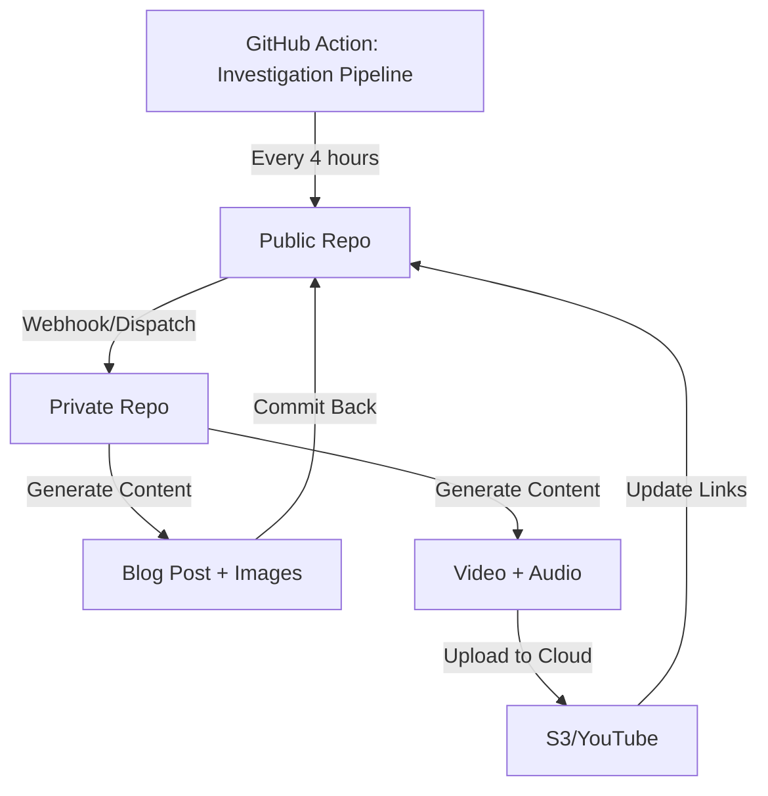

# 🏗️ Two-Repository Architecture

**Status:** ✅ Migration Complete (2025-01-23)

This document describes the split architecture between the public and private repositories.

---

## 📋 Repository Overview

### 🌐 Public Repository: `bestof-opensorce`
**URL:** https://github.com/iberi22/bestof-opensorce  
**Visibility:** PUBLIC  
**Purpose:** Community-driven open source project collection, blog, and investigation database

**Contains:**
- ✅ `investigations/` - Markdown database with project analysis
- ✅ `website/` - Astro blog frontend (static site)
- ✅ `web/` - React dashboard (voice recorder, translations)
- ✅ `src/scanner/` - GitHub repository discovery tools
- ✅ `src/persistence/` - Data storage layer (local & Firebase)
- ✅ `scripts/run_scanner.py` - Public scanner script
- ✅ Community contribution guidelines

**What was removed:**
- ❌ Video generation (TTS, moviepy, rendering)
- ❌ Audio processing (voice cloning, translation)
- ❌ AI blog generation (Gemini prompts, post creation)
- ❌ Private API keys and secrets
- ❌ Docker deployment configs
- ❌ Heavy ML dependencies (Torch, Transformers)

---

### 🔐 Private Repository: `bestof-pipeline`
**URL:** https://github.com/iberi22/bestof-pipeline  
**Visibility:** PRIVATE  
**Purpose:** Content generation pipeline (videos, audio, blog posts)

**Contains:**
- ✅ `src/blog_generator/` - AI-powered blog post creation
- ✅ `src/image_gen/` - Thumbnail and social media image generation
- ✅ `src/narrator/` - TTS narration (currently not implemented)
- ✅ `src/reel_creator/` - Video generation and editing (currently not implemented)
- ✅ `src/voice_pipeline/` - Multilingual audio processing (currently not implemented)
- ✅ `api/multilingual_api.py` - Flask API for content generation
- ✅ `api/worker.py` - Background job processor (Redis Queue)
- ✅ `scripts/manage_investigations.py` - Repo lifecycle manager
- ✅ `TTS/` - Text-to-speech models
- ✅ `Trainer/` - Training data and model checkpoints
- ✅ Docker deployment configs
- ✅ Heavy dependencies (Torch, Transformers, moviepy)

**What was copied:**
- `src/scanner/` - Needed for discovering new repos
- `src/persistence/` - Needed for storing investigation data

---

## 🔄 Communication Flow



### Step-by-Step Flow

1. **Public repo** runs investigation pipeline (every 4 hours or on-demand)
   - Scanner discovers new repositories
   - Updates `investigations/` markdown files
   - Triggers webhook to private repo

2. **Private repo** receives webhook
   - Pulls latest investigation data
   - Generates blog post with Gemini AI
   - Creates social media images
   - (Future) Generates video with TTS narration

3. **Private repo** commits results back to public
   - Blog post → `website/src/content/blog/`
   - Images → `website/public/images/`
   - Video links → metadata in investigation file

4. **Public repo** auto-deploys to GitHub Pages
   - Astro builds static site
   - New blog post appears on website

---

## 🚀 Setup Instructions

### Public Repo Setup

```bash
# Clone public repo
git clone https://github.com/iberi22/bestof-opensorce.git
cd bestof-opensorce

# Install Python dependencies
python -m venv venv
source venv/bin/activate  # Windows: venv\Scripts\activate
pip install -r requirements.txt

# Run scanner
python scripts/run_scanner.py

# Setup Astro blog
cd website
npm install
npm run dev  # Open http://localhost:4321
```

### Private Repo Setup

```bash
# Clone private repo
git clone https://github.com/iberi22/bestof-pipeline.git
cd bestof-pipeline

# Install Python dependencies
python -m venv venv
source venv/bin/activate  # Windows: venv\Scripts\activate
pip install -r requirements.txt

# Configure environment variables
cp .env.example .env
# Edit .env with your API keys:
#   GOOGLE_API_KEY=your_gemini_api_key
#   GITHUB_TOKEN=your_github_token
#   PUBLIC_REPO_WEBHOOK=https://api.github.com/repos/iberi22/bestof-opensorce/dispatches

# Run content generation
python scripts/manage_investigations.py --check
```

---

## 🔑 Required Secrets

### Public Repo GitHub Secrets
- `GITHUB_TOKEN` - Built-in, used for scanning
- `PUBLIC_WEBHOOK_SECRET` - For verifying webhook requests (optional)

### Private Repo GitHub Secrets
- `GOOGLE_API_KEY` - Gemini AI for blog generation
- `GITHUB_TOKEN` - Personal access token with repo permissions
- `PUBLIC_REPO_WEBHOOK` - URL to trigger public repo dispatch
- `AWS_ACCESS_KEY` (optional) - For S3 video storage
- `AWS_SECRET_ACCESS_KEY` (optional)
- `FIREBASE_CREDENTIALS` (optional) - For Firebase storage

---

## 📝 Workflow Integration

### Public Repo Workflow (`.github/workflows/investigation_pipeline.yml`)

```yaml
name: Investigation Pipeline

on:
  schedule:
    - cron: '0 */4 * * *'  # Every 4 hours
  workflow_dispatch:

jobs:
  scan:
    runs-on: ubuntu-latest
    steps:
      - uses: actions/checkout@v4
      - name: Run Scanner
        run: python scripts/run_scanner.py
      
      - name: Trigger Private Pipeline
        if: success()
        run: |
          curl -X POST \
            -H "Authorization: Bearer ${{ secrets.PRIVATE_REPO_PAT }}" \
            -H "Accept: application/vnd.github.v3+json" \
            https://api.github.com/repos/iberi22/bestof-pipeline/dispatches \
            -d '{"event_type":"generate-content"}'
```

### Private Repo Workflow (`.github/workflows/generate_content.yml`)

```yaml
name: Generate Content

on:
  repository_dispatch:
    types: [generate-content]
  workflow_dispatch:

jobs:
  generate:
    runs-on: ubuntu-latest
    steps:
      - uses: actions/checkout@v4
      
      - name: Generate Blog Post
        env:
          GOOGLE_API_KEY: ${{ secrets.GOOGLE_API_KEY }}
        run: python scripts/manage_investigations.py --check
      
      - name: Commit to Public Repo
        env:
          GH_PAT: ${{ secrets.GH_PAT }}
        run: |
          # Clone public repo and commit generated content
          git clone https://$GH_PAT@github.com/iberi22/bestof-opensorce.git public
          cp -r output/blog/* public/website/src/content/blog/
          cd public
          git add .
          git commit -m "chore: Add generated blog post [skip ci]"
          git push
```

---

## 📊 File Statistics

### Public Repo
- **Files:** 176 (excluding node_modules, .git)
- **Size:** 1.67 MB
- **Main languages:** TypeScript, Python, Markdown
- **Frontend:** Astro + Svelte + Tailwind CSS

### Private Repo
- **Files:** 31 (excluding node_modules, .git)
- **Size:** 0.14 MB (without TTS/Trainer)
- **Main languages:** Python
- **Dependencies:** Torch, TTS, moviepy, Transformers

---

## 🎯 Migration Timeline

| Date | Event |
|------|-------|
| 2025-01-23 | Fixed SyntaxError in `manage_investigations.py` |
| 2025-01-23 | Installed Biome, cleaned ESLint warnings |
| 2025-01-23 | Deleted deprecated `blog/` folder (Jekyll) |
| 2025-01-23 | **Created private repo `bestof-pipeline`** |
| 2025-01-23 | **Migrated 23 private files/folders** |
| 2025-01-23 | **Cleaned public repo (21 files removed)** |
| 2025-01-23 | ✅ **Verification complete - All files in correct locations** |

---

## 🔮 Future Improvements

### Phase 1: Webhook Integration ✅
- [x] Create private repository
- [x] Split codebase
- [x] Update documentation
- [ ] Setup webhook communication
- [ ] Test end-to-end flow

### Phase 2: Video Generation
- [ ] Fix `reel_creator` implementation
- [ ] Integrate TTS narration
- [ ] Upload to S3/YouTube
- [ ] Update investigation metadata with video links

### Phase 3: Automation
- [ ] Auto-generate blog posts on new investigations
- [ ] Schedule video generation queue
- [ ] Deploy private API to cloud (AWS/GCP)

### Phase 4: Analytics
- [ ] Track blog post views
- [ ] Monitor video engagement
- [ ] Generate weekly reports

---

## 🤝 Contributing

**Public repo contributions:** Fork the public repo and submit PRs with new investigations or blog improvements.

**Private repo:** Internal team only - contact repo owner for access.

---

## 📞 Support

For questions about this architecture:
- **Public repo issues:** https://github.com/iberi22/bestof-opensorce/issues
- **Private repo:** Contact repo maintainer directly

---

**Last Updated:** 2025-01-23  
**Migration Status:** ✅ Complete  
**Verification:** ✅ All tests passed
